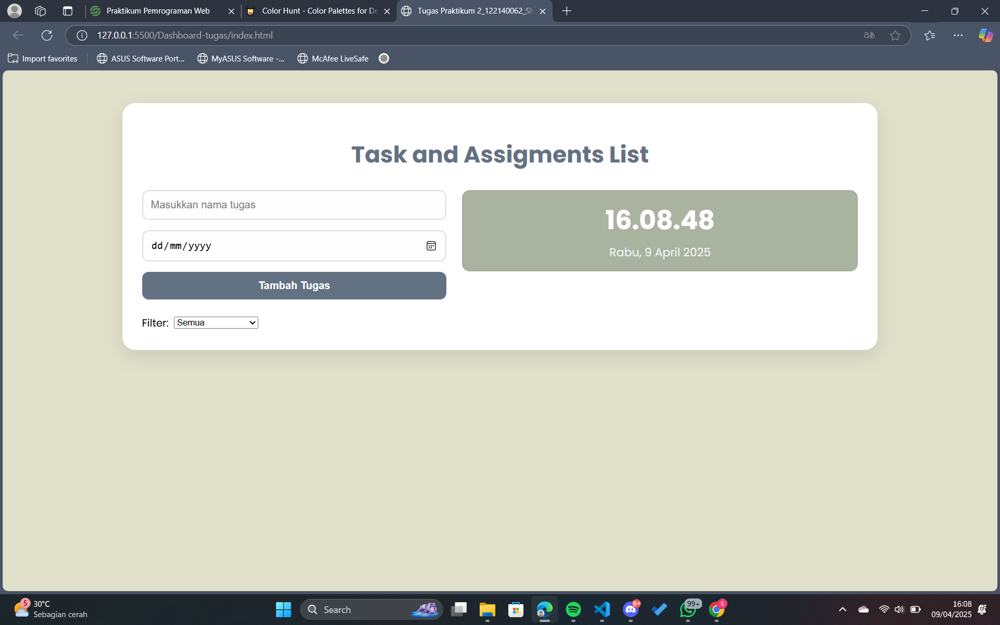
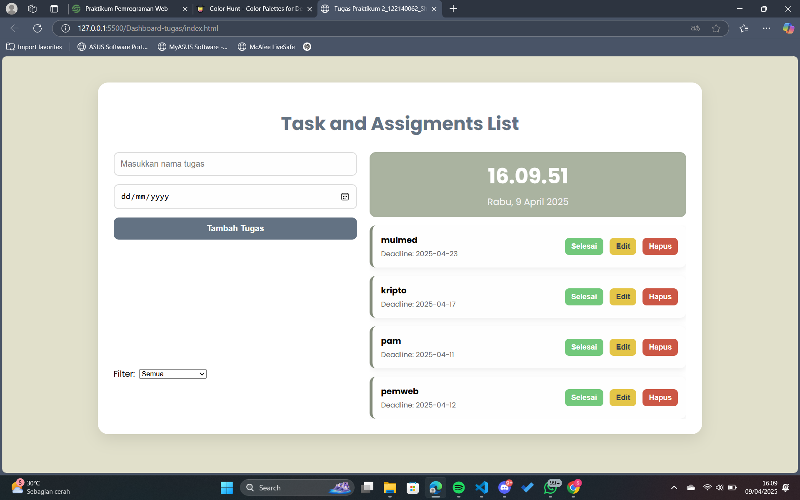
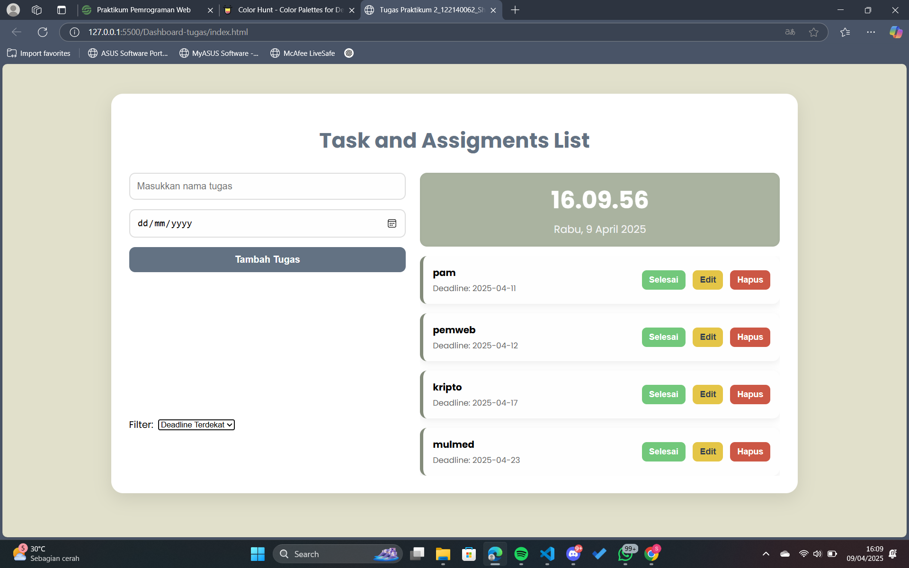

# Dashboard Tugas
**Nama:** Shafa Aulia  
**NIM:** 122140062  
**Mata Kuliah:** Praktikum 2 Pemrograman Web RB  

## Fungsi Aplikasi

Aplikasi Dashboard Tugas ini berfungsi untuk membantu mahasiswa dalam mengatur dan mengelola daftar tugas kuliah. Pengguna dapat menambahkan tugas baru beserta deadline, menandai tugas yang sudah selesai, mengedit tugas yang ada, dan menghapus tugas. Tugas-tugas yang telah dimasukkan akan tersimpan secara otomatis di browser melalui fitur penyimpanan lokal. Aplikasi ini juga memungkinkan pengguna untuk memfilter tugas berdasarkan deadline terdekat agar lebih mudah dalam mengatur prioritas.

## Fitur Aplikasi

1. Menambah, mengedit, dan menghapus data tugas
2. Menampilkan jam dan tanggal
3. Menyimpan data tugas secara lokal menggunakan localStorage
4. Memfilter tugas berdasarkan deadline terdekat
5. Menampilkan status tugas (selesai/belum selesai)

## Fitur ES6+ yang Diimplementasikan

- **`let` dan `const`** digunakan untuk deklarasi variabel dengan cakupan block
- **Arrow Function** digunakan dalam `renderTasks`, `handleAdd`, `updateClock`, dan method pada class `TaskManager.
- **Template Literals** digunakan untuk menyusun elemen HTML secara dinamis dalam `renderTasks()`
- **Async/Await** diimplementasikan pada fungsi `updateClock()` untuk memperbarui waktu secara real-time
- **Classes** digunakan untuk membuat blueprint `Task` dan `TaskManager` sesuai standar ES6

## Screenshot Aplikasi

### Tampilan 1

### Tampilan 2 
#### menambahkan tugas

### Tampilan 3 
#### menggunakan fitur **deadline terdekat**.

